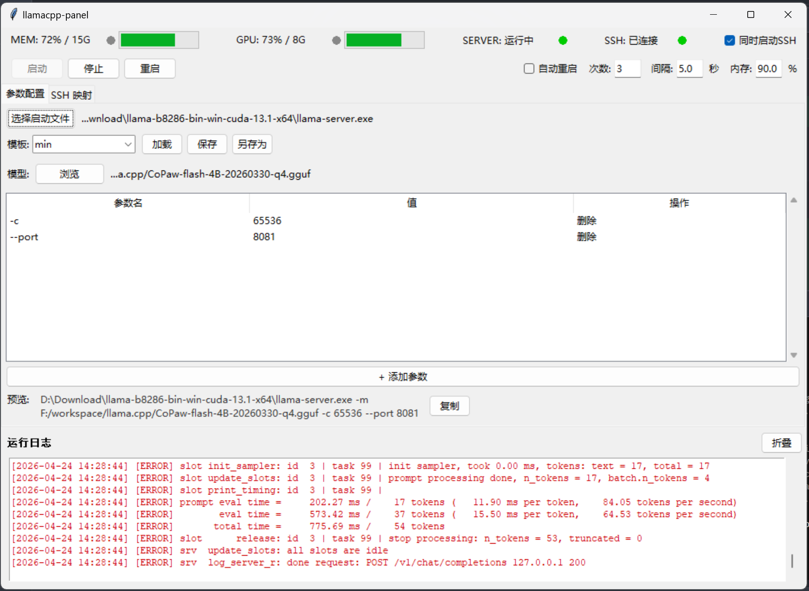

# llamacpp-panel

Lightweight GUI management tool for llama.cpp, built with Python Tkinter, zero third-party GUI dependencies.

**Language**: [English](README.md) | [中文](README.zh.md)



## Features

- **Visual Executable Selection** — File dialog with history for selecting llama.cpp server binary
- **Parameter Configuration** — Visual parameter editor with preset templates (Minimum/GPU/Full), command preview, and save/load
- **Real-time Resource Monitoring** — System RAM, GPU memory, and server status in 4-column grid layout with color indicators
- **Automatic Restart** — Configurable auto-restart with max count, interval, and memory threshold parameters
- **SSH Port Mapping** — Reverse SSH tunnel with connection status, optional auto-start when server ready
- **Template with SSH Config** — Save/load templates including SSH connection parameters
- **One-click Start/Stop** — Simple start/stop/restart controls with real-time log output
- **Terminal Debug Logs** — Detailed logs to both file (log/YYYY-MM-DD.txt) and console
- **Persistent Configuration** — Auto-save/load settings across sessions

## Installation

### Option 1: Virtual Environment (Recommended)

```bash
python3 -m venv venv
source venv/bin/activate
pip install -r requirements.txt
```

### Option 2: Global Install

```bash
pip install -r requirements.txt
```

## Usage

```bash
python main.py
```

Logs saved to `log/YYYY-MM-DD.txt`, also printed to terminal.

## Testing

```bash
pytest tests/ -v
pytest tests/ --cov=src --cov-report=html
```

## Building

### Python Package

```bash
pip install build
python -m build
```

### Windows EXE (PyInstaller)

```bash
pip install pyinstaller
pyinstaller -F -w -n llamacpp-panel --icon=llamacpp-panel.ico main.py
```

Output: `dist\llamacpp-panel.exe`

## Architecture

```
src/
├── models/        # Data models (@dataclass)
├── services/      # Business logic
├── ui/            # Tkinter interface
└── utils/         # Utilities
config/
├── app_config.json    # Saved configuration
└── templates/*.json   # User templates (with SSH config)
log/
└── YYYY-MM-DD.txt     # Daily log files
```

See [docs/design/](docs/design/) for detailed design documents.

## License

MIT License - See [LICENSE](LICENSE)
