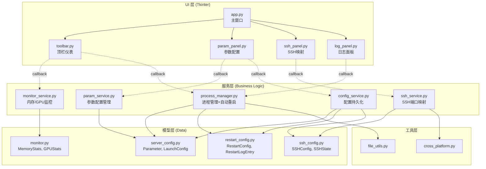
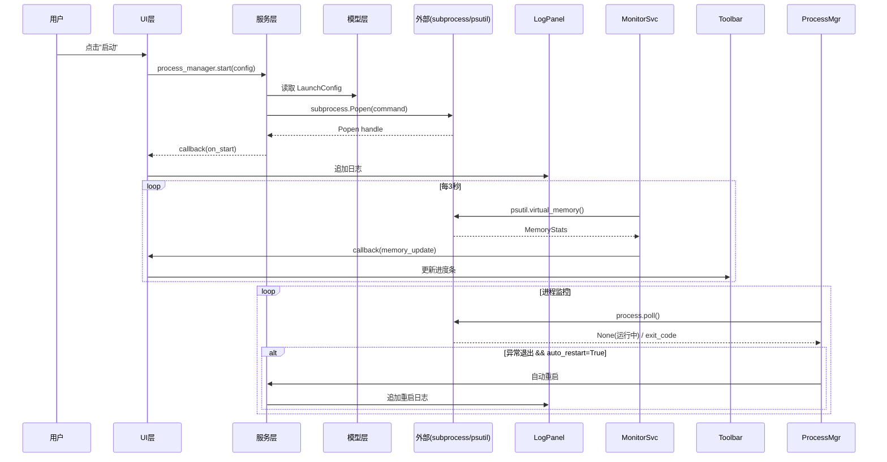

# llamacpp-panel 设计文档

## 目录

| 文档 | 路径 | 内容 |
|------|------|------|
| 总体架构 | 本文 | 项目信息、架构图、术语表、默认值、模板、验证规则、错误类型、测试策略 |
| UI 设计 | [ui_design.md](./ui_design.md) | 窗口布局、组件层级、交互流程、事件流、跨平台兼容 |
| 模型层 | [models/README.md](./models/README.md) | dataclass 定义、字段约束、序列化格式、类图 |
| 服务层 | [services/README.md](./services/README.md) | 服务接口、线程模型、回调协议、状态机、协作序列图 |
| UI 组件 | [ui/README.md](./ui/README.md) | App/Toolbar/ParamPanel/SSHPanel/LogPanel 详细设计 |
| 工具层 | [utils/README.md](./utils/README.md) | 文件工具、跨平台兼容函数 |

## 项目信息

| 项目类型 | feature_dev |
|----------|-------------|
| 平台 | Windows / Linux |
| 语言/运行时 | Python 3.9+ |
| 构建方式 | 解释执行 |
| CI/CD 状态 | 未配置 |

## 架构总览

## 数据流

## 术语表

| 术语 | 代码值 | UI标签 | 说明 |
|------|--------|--------|------|
| 参数分类 | "model"/"context"/"gpu"/"network"/"other" | 模型/上下文/GPU/网络/其他 | Parameter.category |
| SSH状态 | "disconnected"/"connecting"/"connected" | 未连接/连接中/已连接 | SSHState |
| 重启原因 | "crash"/"memory_threshold" | 崩溃/内存超阈值 | RestartLogEntry.reason |
| 内存百分比 | 0.0 - 100.0 | 百分比数值 | MemoryStats.percent |
| 内存阈值 | 0.0 - 100.0 | 百分比数值 | RestartConfig.memory_threshold |
| 端口范围 | 1 - 65535 | 整数 | SSHConfig.local_port/remote_port |

## 配置默认值

| 配置项 | 默认值 | 说明 |
|--------|--------|------|
| 监控刷新间隔 | 3.0s | monitor_service interval |
| 最大重启次数 | 3 | restart_config max_restarts |
| 内存阈值 | 90.0% | restart_config memory_threshold |
| SSH本地端口 | 8080 | ssh_config local_port |
| SSH远程端口 | 8080 | ssh_config remote_port |
| SSH远程主机 | "172.18.122.71" | ssh_config remote_host |
| SSH用户名 | "root" | ssh_config username |
| 配置存储路径 | config/app_config.json | config_service |

## 预设参数模板

| 模板名 | 参数列表 |
|--------|---------|
| 最小配置 | `-m`(必填), `-c 2048` |
| GPU加速 | `-m`(必填), `-c 4096`, `-ngl 99` |
| 全功能 | `-m`(必填), `-c 4096`, `-ngl 99`, `--threads 4`, `--host 127.0.0.1`, `--port 8080` |

## 验证规则

| 字段 | 验证规则 |
|------|---------|
| server_path | 文件必须存在，且为可执行文件 |
| parameter value (required=True) | 不能为空 |
| port | 1 - 65535 |
| memory_threshold | 0.0 - 100.0 |
| max_restarts | 0 - 100 |
| threads | 1 - 系统CPU核心数 |

## 错误类型

| 异常类 | 触发条件 | UI反馈 |
|--------|---------|--------|
| ProcessError | 进程启动失败 | messagebox + 日志 |
| SSHError | SSH连接失败 | messagebox + 日志 |
| ConfigError | 配置读写失败 | 日志 + 使用默认值 |

## 测试策略

| 模块 | 测试重点 | Mock |
|------|---------|------|
| param_service | 命令拼接、模板加载、校验 | 无 |
| config_service | JSON读写、历史记录 | 临时文件 |
| process_manager | 启动/停止/重启逻辑 | subprocess.Popen |
| monitor_service | 内存采集、回调 | psutil |
| ssh_service | 命令构建、状态管理 | subprocess.Popen |

## 禁止事项

1. UI 层直接操作 subprocess 或 psutil（必须通过 services）
2. 模型类包含业务逻辑
3. 硬编码配置值（所有默认值在 config.py）
4. UI 线程阻塞（耗时操作必须后台线程）
5. 缺少类型标注
