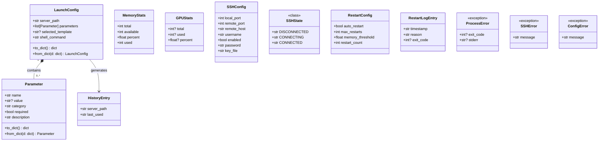

# 模型层设计文档

## 1. 模块总览

| 文件 | 包含类型 | 职责 |
|------|---------|------|
| `server_config.py` | Parameter, LaunchConfig, HistoryEntry | 服务启动配置 |
| `monitor.py` | MemoryStats, GPUStats | 系统资源状态 |
| `ssh_config.py` | SSHConfig, SSHState | SSH 端口映射配置 |
| `restart_config.py` | RestartConfig, RestartLogEntry | 自动重启配置 |
| `errors.py` | ProcessError, SSHError, ConfigError | 异常类型 |

## 2. 类图



## 3. 字段约束

### Parameter

| 字段 | 类型 | 必填 | 约束 |
|------|------|------|------|
| name | str | 是 | 非空，以 `-` 开头 |
| value | str\|None | 否 | required=True 时不可为 None |
| category | str | 是 | 枚举: model/context/gpu/network/other |
| required | bool | 是 | - |
| description | str | 否 | - |

### LaunchConfig

| 字段 | 类型 | 必填 | 约束 |
|------|------|------|------|
| server_path | str | 是 | 文件必须存在且可执行 |
| parameters | list[Parameter] | 否 | - |
| selected_template | str\|None | 否 | - |
| shell_command | str | 是 | 由 service 层拼接，模型仅存储 |

### HistoryEntry

| 字段 | 类型 | 必填 | 约束 |
|------|------|------|------|
| server_path | str | 是 | - |
| last_used | str | 是 | ISO 8601 格式 |

### MemoryStats

| 字段 | 类型 | 必填 | 约束 |
|------|------|------|------|
| total | int | 是 | bytes |
| available | int | 是 | bytes |
| percent | float | 是 | 0.0 - 100.0 |
| used | int | 是 | bytes |

### GPUStats

| 字段 | 类型 | 必填 | 约束 |
|------|------|------|------|
| total | int\|None | 是 | bytes, None=不可用 |
| used | int\|None | 是 | bytes, None=不可用 |
| percent | float\|None | 是 | 0.0 - 100.0, None=不可用 |

### SSHConfig

| 字段 | 类型 | 必填 | 约束 |
|------|------|------|------|
| local_port | int | 是 | 1 - 65535 |
| remote_port | int | 是 | 1 - 65535 |
| remote_host | str | 是 | 非空 |
| username | str | 是 | 非空 |
| enabled | bool | 是 | - |
| password | str | 否 | SSH 登录密码 |
| key_file | str | 否 | SSH 私钥文件路径 |

### RestartConfig

| 字段 | 类型 | 必填 | 约束 |
|------|------|------|------|
| auto_restart | bool | 是 | - |
| max_restarts | int | 是 | 0 - 100 |
| memory_threshold | float | 是 | 0.0 - 100.0 |
| restart_count | int | 是 | 初始值 0, 运行时递增 |

### RestartLogEntry

| 字段 | 类型 | 必填 | 约束 |
|------|------|------|------|
| timestamp | str | 是 | ISO 8601 |
| reason | str | 是 | 枚举: crash/memory_threshold |
| exit_code | int\|None | 否 | crash 时有值 |

## 4. 序列化格式

所有配置类（LaunchConfig, SSHConfig, RestartConfig）实现：

```
to_dict() -> dict         # 嵌套序列化
from_dict(dict) -> Self   # 嵌套反序列化
```

**JSON 存储结构:**

```json
{
    "launch_config": {
        "server_path": "/usr/local/bin/server",
        "parameters": [
            {"name": "-m", "value": "model.gguf", "category": "model", "required": true, "description": "模型路径"},
            {"name": "-c", "value": "4096", "category": "context", "required": false, "description": "上下文长度"}
        ],
        "selected_template": "GPU加速",
        "shell_command": "server -m model.gguf -c 4096"
    },
    "restart_config": {
        "auto_restart": true,
        "max_restarts": 3,
        "memory_threshold": 90.0,
        "restart_count": 0
    },
    "ssh_config": {
        "local_port": 8080,
        "remote_port": 8080,
        "remote_host": "172.18.122.71",
        "username": "root",
        "enabled": false,
        "password": "",
        "key_file": ""
    },
    "history": [
        {"server_path": "/usr/local/bin/server", "last_used": "2026-04-24T10:00:00Z"}
    ]
}
```

## 5. 异常类型

| 异常类 | 字段 | 触发条件 |
|--------|------|---------|
| ProcessError | exit_code, stderr | 进程启动失败 |
| SSHError | message | SSH 连接失败 |
| ConfigError | message | 配置读写失败 |

## 6. 模型约束总结

| 模型 | 必填字段 | 可选字段 | 约束条件 |
|------|---------|---------|---------|
| Parameter | name, category | value, description | name 以 `-` 开头, required 时 value 非空 |
| LaunchConfig | server_path | parameters, template, command | server_path 文件必须存在 |
| SSHConfig | all | enabled | port 范围 1-65535 |
| RestartConfig | all | - | max_restarts 0-100, threshold 0-100 |
| HistoryEntry | all | - | 时间戳 ISO 8601 |
