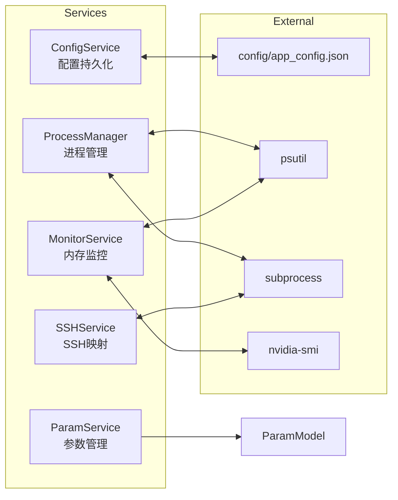
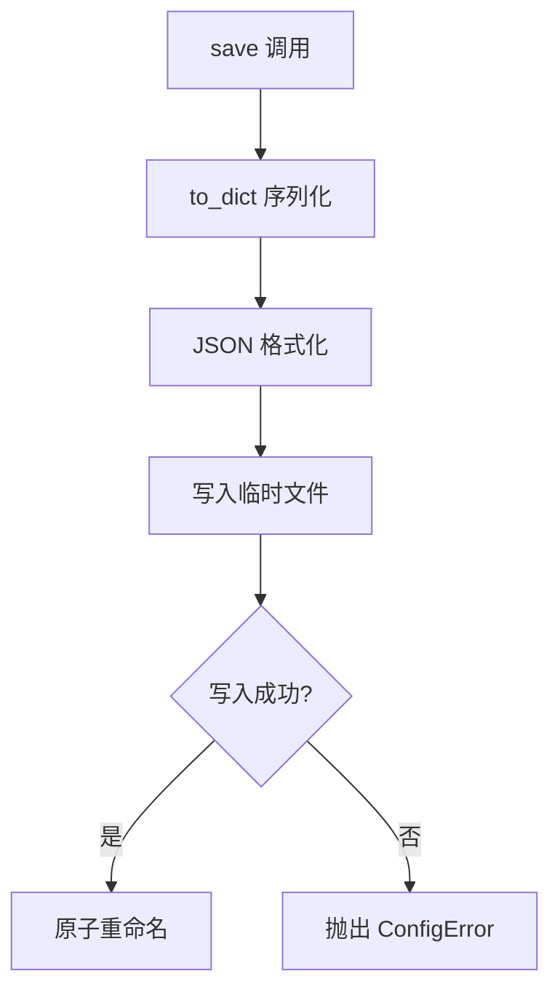
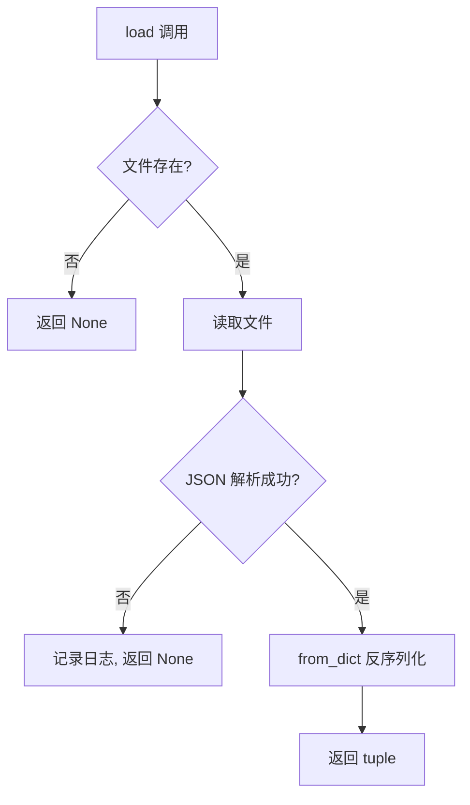
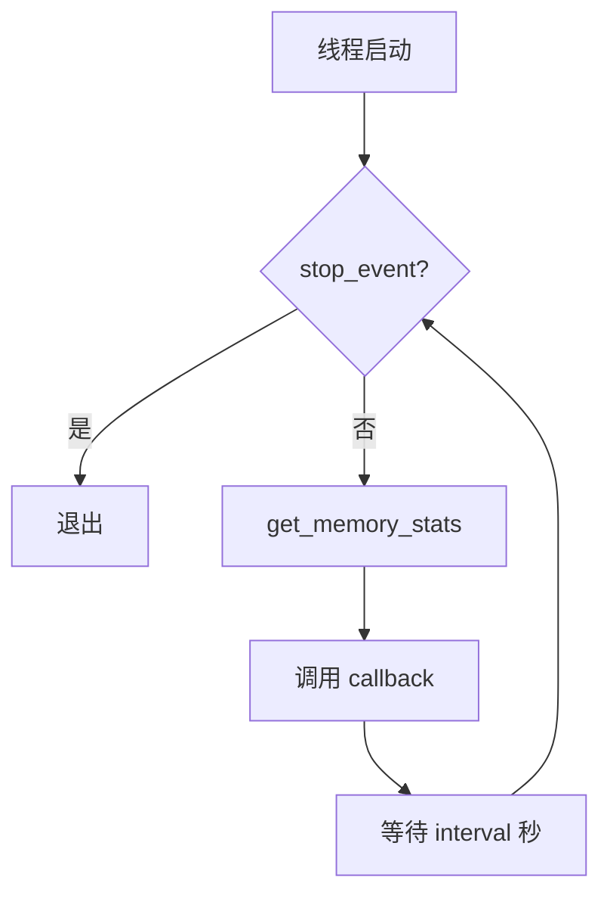
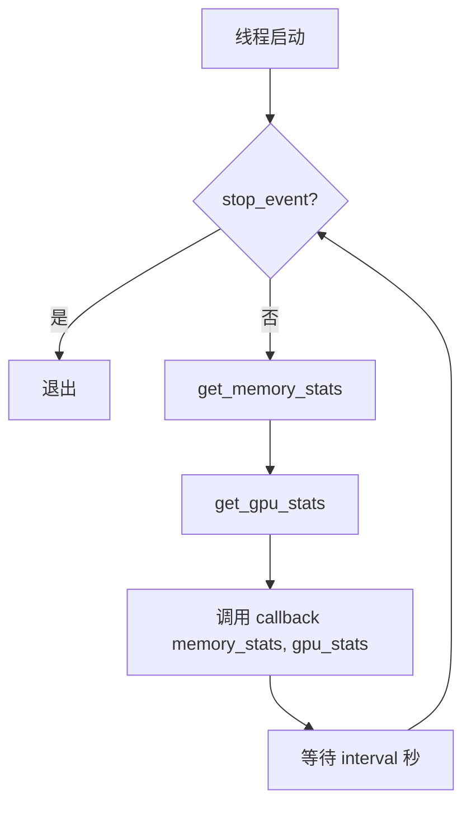
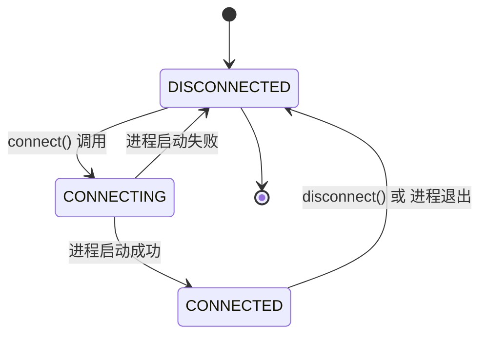
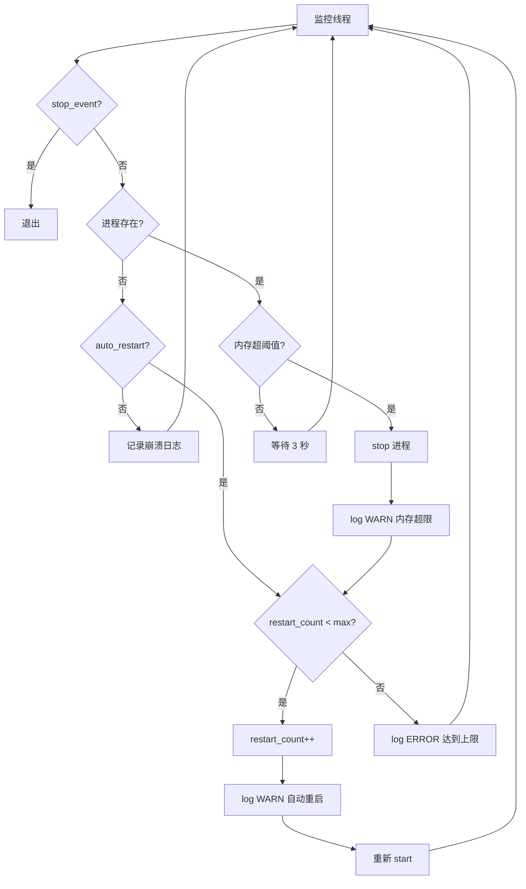
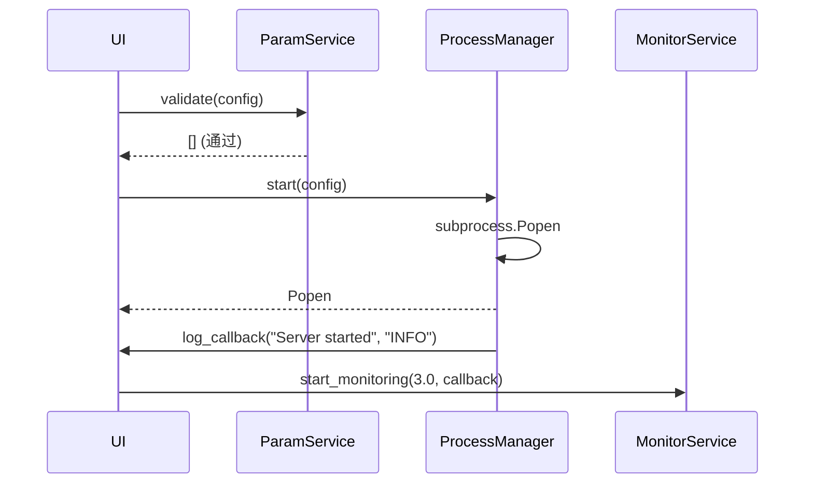
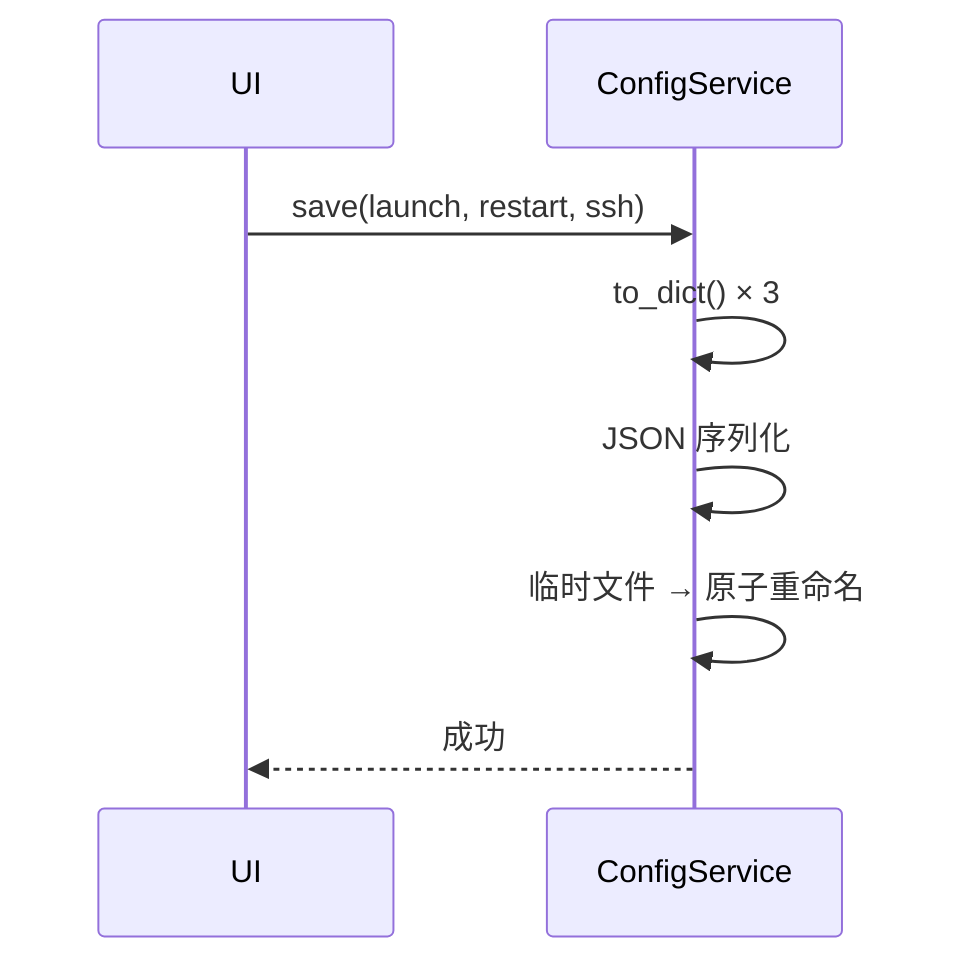

# 服务层设计文档

## 1. 模块总览

| 文件 | 类 | 外部依赖 | 线程安全 |
|------|---|---------|---------|
| `config_service.py` | ConfigService | json, pathlib | 是（文件锁） |
| `param_service.py` | ParamService | 无 | 是（无状态） |
| `monitor_service.py` | MonitorService | psutil | 是（threading.Event） |
| `ssh_service.py` | SSHService | subprocess | 是（Popen 保护） |
| `process_manager.py` | ProcessManager | subprocess, psutil | 是（threading.Event） |

## 2. 服务架构图



## 3. 各服务接口定义

### 3.1 ConfigService

**职责**: 配置的持久化存储与加载

| 方法 | 输入 | 返回 | 说明 |
|------|------|------|------|
| `save()` | LaunchConfig, RestartConfig, SSHConfig | None | 序列化所有配置到 JSON |
| `load()` | - | tuple 或 None | 加载配置，失败返回 None |
| `save_history()` | HistoryEntry | None | 追加/更新历史记录 |
| `get_history()` | - | list[HistoryEntry] | 按时间降序返回 |

**异常处理:**
- 文件不存在 → `load()` 返回 None
- JSON 格式错误 → 记录日志，返回 None
- 写入失败 → 抛出 `ConfigError`

**线程安全**: 读写使用 `threading.Lock()`

**保存流程:**



**加载流程:**



### 3.2 ParamService

**职责**: 参数配置的 CRUD、模板管理、命令拼接、校验

| 方法 | 输入 | 返回 | 说明 |
|------|------|------|------|
| `build_command()` | LaunchConfig | str | 参数列表 → shell 命令 |
| `get_template()` | str (模板名) | list[Parameter] | 返回模板深拷贝 |
| `save_template()` | str (模板名), list[Parameter] | None | 保存模板到 JSON 文件 |
| `get_template_names()` | - | list[str] | 返回所有可用模板名 |
| `validate()` | LaunchConfig | list[str] | 错误信息列表，空=通过 |

**模板持久化:**

模板存储为独立 JSON 文件: `config/templates/<模板名>.json`

格式:
```json
{
    "name": "GPU加速",
    "parameters": [
        {"name": "-c", "value": "4096", "category": "基础", "required": false, "description": "上下文大小"},
        {"name": "-ngl", "value": "99", "category": "GPU", "required": false, "description": "GPU层数"}
    ]
}
```

**注意**: 模板不含 `-m` 参数（模型路径由 UI 独立管理）。加载模板时自动排除 `-m`，拼接命令时自动追加 `-m {模型路径}`。

**预设模板 (DEFAULT_TEMPLATES, 仅作为首次启动时的默认值):**

| 模板名 | 参数列表 |
|--------|---------|
| 最小配置 | `-m`(必填), `-c 2048` |
| GPU加速 | `-m`(必填), `-c 4096`, `-ngl 99` |
| 全功能 | `-m`(必填), `-c 4096`, `-ngl 99`, `--threads 4`, `--host 127.0.0.1`, `--port 8080` |

**命令拼接规则:**

| 场景 | 规则 |
|------|------|
| value 非空 | 追加 `name value` |
| value 为空 | 追加 `name` |
| 最终格式 | `server_path` + 拼接参数 |

**校验规则:**

| 校验项 | 规则 | 错误信息 |
|--------|------|---------|
| server_path | 文件存在且可执行 | "服务器可执行文件不存在或不可执行" |
| required 参数 | required=True 时 value 非空 | "必填参数 {name} 的值为空" |
| port | 1 - 65535 | "端口号 {value} 超出范围" |
| threads | 1 - CPU 核心数 | "线程数 {value} 超出范围" |

### 3.3 MonitorService

**职责**: 采集系统内存和 GPU 使用信息，通过回调通知 UI

| 方法 | 输入 | 返回 | 说明 |
|------|------|------|------|
| `get_memory_stats()` | - | MemoryStats | 调用 psutil 采集 |
| `get_gpu_stats()` | - | GPUStats\|None | 尝试 nvidia-smi，失败返回 None |
| `start_monitoring()` | interval, callback | None | 启动后台线程 |
| `stop_monitoring()` | - | None | 停止线程 |

**后台线程行为:**



**参数:**
- interval: 默认 3.0 秒
- callback: `Callable[[MemoryStats, GPUStats | None], None]`

**后台线程行为 (更新):**



### 3.4 SSHService

**职责**: 管理 SSH 反向端口映射

| 方法 | 输入 | 返回 | 说明 |
|------|------|------|------|
| `build_command()` | SSHConfig | str | 构建 SSH 命令字符串 |
| `connect()` | SSHConfig | Popen | 执行连接 |
| `disconnect()` | Popen\|None | None | 终止进程 |
| `get_state()` | Popen\|None | str | 返回 SSHState 常量 |

**SSH 命令格式:**

```
# 无密码/密钥:
ssh -R 0.0.0.0:{remote_port}:127.0.0.1:{local_port}
    -o StrictHostKeyChecking=no
    -N
    {username}@{remote_host}

# 有密钥:
ssh -R ... -o StrictHostKeyChecking=no -N -i {key_file} {username}@{remote_host}

# 有密码 (使用 sshpass):
sshpass -p {password} ssh -R ... -o StrictHostKeyChecking=no -N {username}@{remote_host}
```

**状态机:**



### 3.5 ProcessManager

**职责**: 管理 llama.cpp 进程生命周期，包含自动重启

| 方法 | 输入 | 返回 | 说明 |
|------|------|------|------|
| `start()` | LaunchConfig | Popen | 启动进程，失败抛 ProcessError |
| `stop()` | Popen\|None | None | SIGTERM → 等待 → SIGKILL |
| `is_running()` | Popen\|None | bool | 检查进程存活 |
| `enable_auto_restart()` | LaunchConfig, RestartConfig, MonitorService | None | 启动监控线程 |
| `disable_auto_restart()` | - | None | 停止监控线程 |

**进程启动:**
- 使用 shell_command.split() 构建参数列表
- 捕获 stdout/stderr
- text 模式

**停止策略:**
- SIGTERM → 等待 5 秒
- 未退出 → SIGKILL

**自动重启逻辑:**



## 4. 服务间协作

### 4.1 启动序列



### 4.2 配置保存序列



## 5. 回调协议

| 服务 | 回调签名 | 触发时机 |
|------|---------|---------|
| ProcessManager | `Callable[[str, str], None]` | 进程状态变化 |
| MonitorService | `Callable[[MemoryStats, GPUStats\|None], None]` | 每 3 秒 |
| SSHService | `Callable[[str, str], None]` | SSH 状态变化 |
| ConfigService | 无回调 | 同步操作 |
